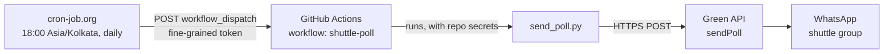
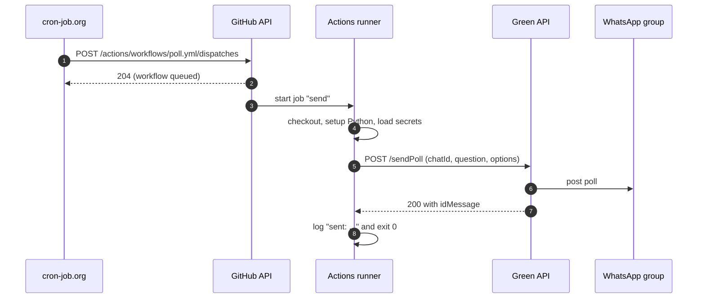
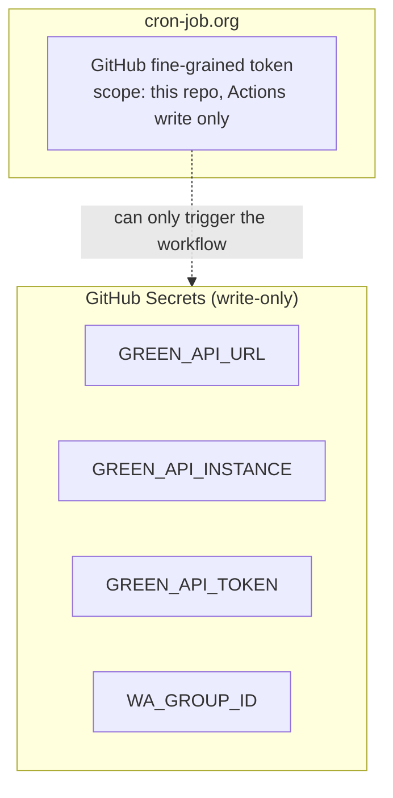
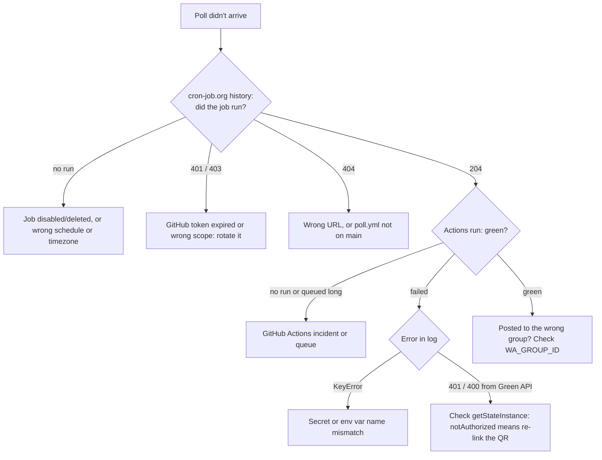

# shuttle-poll

Posts a WhatsApp poll — **"🏸 Playing tomorrow?"** (Yes / No, single choice) — to the shuttle group every day at **6:00 PM IST**.

Cost: ₹0/month. Nothing is hosted.

> Full setup steps, gotchas and checklists are in [`shuttle-poll-build-doc.md`](shuttle-poll-build-doc.md). This README is the overview.

## Architecture

Three free services, each doing one job:

| Service | Role |
| --- | --- |
| **cron-job.org** | Scheduler. Fires on the minute at 18:00 Asia/Kolkata. |
| **GitHub Actions** | Runner. Executes `send_poll.py` with the secrets. |
| **Green API** | WhatsApp gateway. Holds the linked WhatsApp session and posts the poll. |



### One run, step by step



A `204` in cron-job.org only means the workflow was **queued**. Whether the poll was actually sent is visible in the Actions run log (`sent:` or the Green API error).

### Where secrets live



The Green API token can't be scoped — it controls the whole WhatsApp instance — so it is kept only in GitHub Secrets and never given to cron-job.org. The token cron-job.org holds can only trigger this one workflow.

## Why not GitHub's own cron?

GitHub's `schedule:` trigger is best-effort and fired this poll **4–8 hours late**. It has been removed from `poll.yml`; only `workflow_dispatch` remains, called on time by cron-job.org.

**Do not re-add a `schedule:` trigger as a backup.** A late GitHub run on top of the on-time one would post a duplicate poll to the group.

## Repo layout

```
.
├── send_poll.py                 # builds the poll payload and calls Green API
├── shuttle-poll-build-doc.md    # full setup guide and checklists
└── .github/workflows/poll.yml   # workflow_dispatch only; runs send_poll.py
```

## Configuration

Four repository secrets (Settings → Secrets and variables → Actions):

| Secret | Value |
| --- | --- |
| `GREEN_API_URL` | Green API `apiUrl` |
| `GREEN_API_INSTANCE` | `idInstance` |
| `GREEN_API_TOKEN` | `apiTokenInstance` |
| `WA_GROUP_ID` | target group id, `…@g.us` |

cron-job.org job: `POST https://api.github.com/repos/<owner>/shuttle-poll/actions/workflows/poll.yml/dispatches`, body `{"ref":"main"}`, with `Authorization`, `Accept`, `X-GitHub-Api-Version` and `User-Agent` headers. Details are in the build doc, section 6.

## ⚠️ Safety

- **The "Run workflow" button and cron-job.org's "Test run" both post a real poll** to whichever group `WA_GROUP_ID` points at.
- To test, point `WA_GROUP_ID` at a throwaway group first, then **switch it back to the live group**.

## When it stops working



## Maintenance

- **Rotate the GitHub token** before it expires (max 1 year). When it expires the poll stops silently apart from cron-job.org's failure email.
- **Rotate the Green API token** if it is ever exposed, then update the `GREEN_API_TOKEN` secret.
- **Keep the bot phone active.** After ~14 days without WhatsApp activity the session drops (`notAuthorized`) and the QR needs re-linking.
- **Free plan cap:** Green API's Developer plan allows interaction with 3 chats per month.
